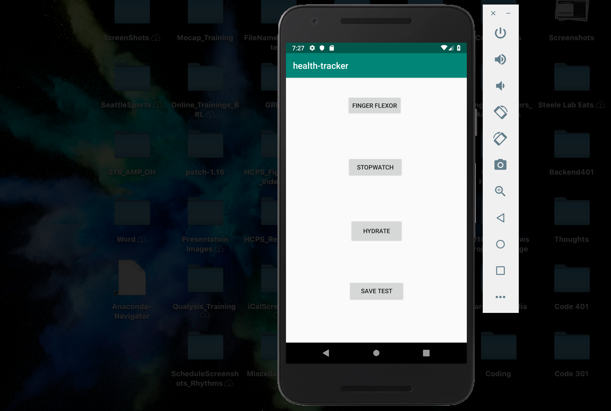
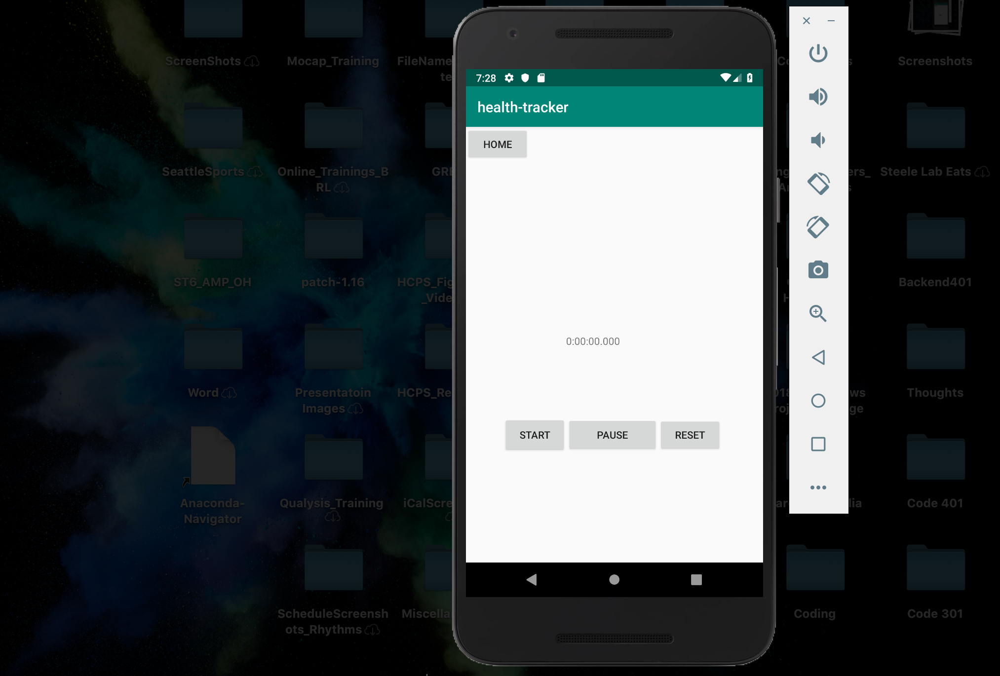
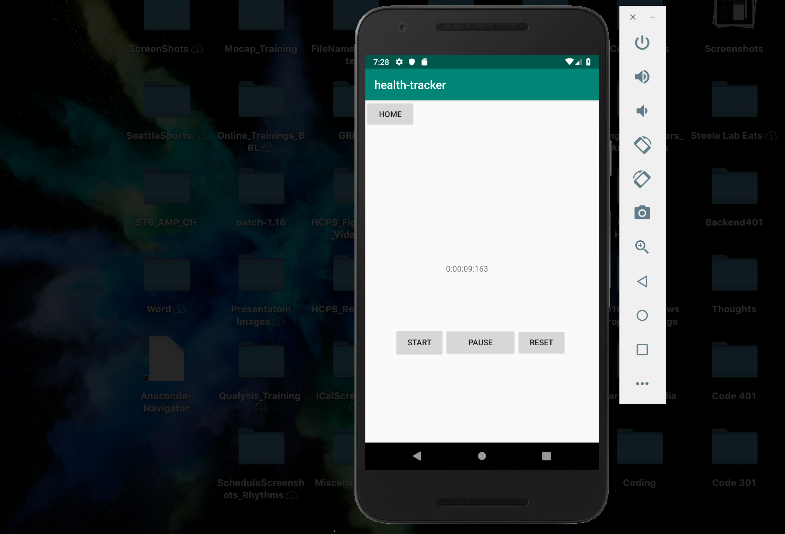
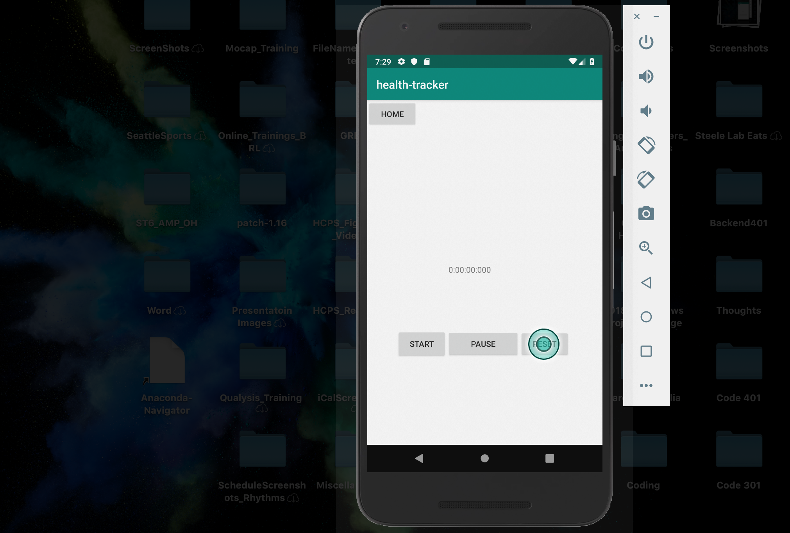
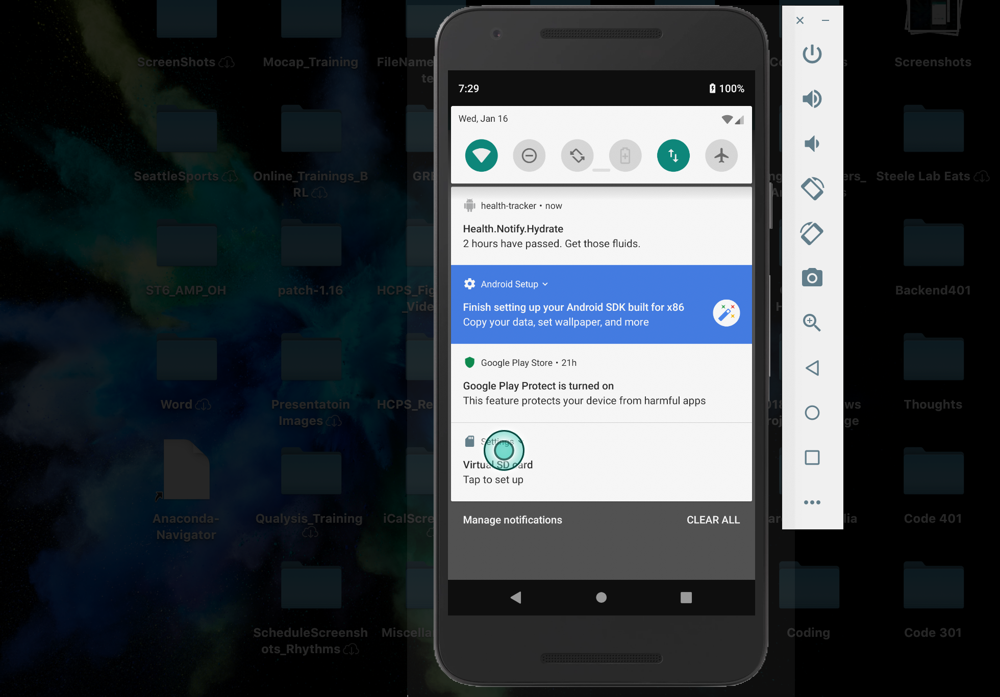
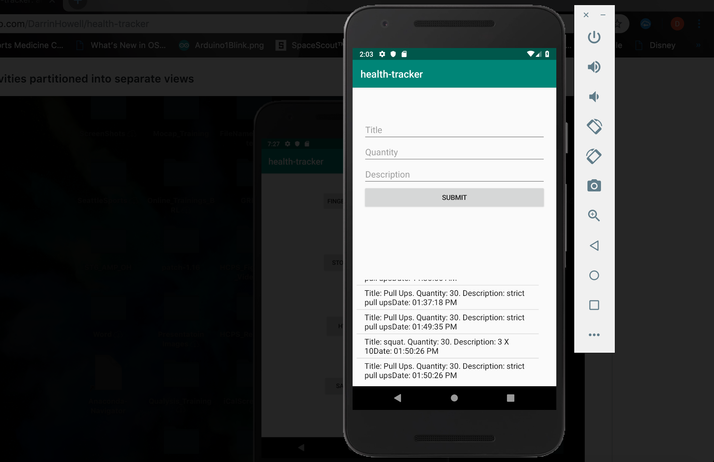

# Health Tracker

### Author: 
Darrin Howell

# Change Log

## 20190108:
* Initial setup of app.
* Added counter feature upon button click.
* Added buttons that control a stop watch.
* Stopwatch keeping track of time elapsed. 

## 20190109:
* Separated activities into different views. 
* Notifications being scheduled in the future. 

## 20190110:
* Added annotations to Room database implementation
* Having compiler errors adding to the database

## 20190116
* Added form to exercise diary
* Database rendering data
* Database updating when input entered into form

## Features on display: 

#### Activities partitioned into separate views

#### Finger Flexor, no clicks

#### Finger Flexor, 10 clicks

#### Stop watch, not started

#### Stop watch, time elapsed

#### Stop watch, paused

#### Stop watch, reset

#### Notification sent

#### Exercise Diary with form

